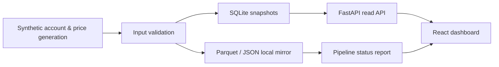

# ReachRich Public Lab

[](https://github.com/YongjaeKwon/quant-lab/actions/workflows/tests.yml)

**English** | [한국어](README.ko.md)

I'm building a personal quant project called ReachRich. Its repository mixes real account data with brokerage integrations, so it can't be published as-is — instead, I carved out the parts that can be public and rebuilt them here. The way data is stored, validated, and queried is the same as in the original, but every piece of data flowing through is synthetic, generated by fixed rules.

This is not a copy of the private repository with the sensitive parts deleted — it was written from scratch. There are no real accounts, no Toss Securities / KRX integrations, no strategies, and no performance results here. Every amount and symbol on screen is synthetic.

## What's implemented

| What to check | How it works | Start here |
| --- | --- | --- |
| Re-runnable data preparation | SQLite snapshots that replace same-date rows, and date-keyed Parquet upserts | [`operation/demo_pipeline.py`](operation/demo_pipeline.py) |
| Separation of storage and API | FastAPI never calls external services — it reads only the local mirror | [`console/api.py`](console/api.py) |
| Time-series input validation | Ordering, duplicates, future-dated rows, and OHLC consistency are checked before writing | [`validation/time_series.py`](validation/time_series.py) |
| State-aware UI | React screens handle loading / error / empty states, amount masking, themes, and pause polling in hidden tabs | [`console/web/src/App.tsx`](console/web/src/App.tsx) |
| Explicit public/private boundary | Strategies expose interfaces only; concrete implementations and performance data are excluded | [`strategy/contracts.py`](strategy/contracts.py) |

## Data flow



Seeding data and running the dashboard make no outbound requests. The only network access happens when packages are first installed from PyPI and npm.

## The original project

ReachRich is a personal investment system built around validation discipline. The following jobs currently run automatically every day:

- Real-account snapshot collection via a brokerage API, with a web dashboard
- Paper-trading accrual on GitHub Actions
- A trading journal that stores the chart as it looked at the moment of each trade
- Daily computation of market regime and per-symbol grades

There is no live order placement yet. Even a strategy that passes backtesting must survive walk-forward paper trading before it becomes a candidate for real use.

The validation principles:

- The backtest runner hands a strategy only the data available up to that point in time — lookahead is impossible by construction.
- Every experiment attempt is automatically recorded in a ledger, and the bar for acceptance rises as attempts accumulate.
- Parameter searches run only against pre-registered candidates; the ledger rejects anything not registered.
- Failed hypotheses are kept on record, never deleted. A revised idea is validated again as a new hypothesis.

The snapshot-replacement storage, date-keyed upserts, and time-series input validation in this repository are exactly the mechanisms used in the original.

## Quick start

Requires Python 3.11+ and Node.js 20+. The examples below use PowerShell.

```powershell
py -3.12 -m venv .venv
.\.venv\Scripts\Activate.ps1
python -m pip install -e ".[dev]"

npm.cmd ci --prefix console/web
npm.cmd run build --prefix console/web

python -m scripts.seed_demo --reset --asof 2026-08-07
python -m scripts.dashboard
```

Then open:

- Dashboard: <http://127.0.0.1:8720>
- Swagger UI: <http://127.0.0.1:8720/docs>
- Health check: <http://127.0.0.1:8720/api/health>

The dashboard runs locally without authentication, and the launcher script refuses to bind to anything other than `127.0.0.1` or `localhost`.

### Frontend dev mode

Run the API and Vite in two terminals:

```powershell
# terminal 1
python -m scripts.dashboard

# terminal 2
npm.cmd run dev --prefix console/web
```

The Vite dev server proxies `/api` requests to `127.0.0.1:8720`.

## Verification

Run the full verification suite in one go:

```powershell
.\scripts\verify.ps1
```

Or run the individual steps:

```powershell
python -m pytest -q
python -m scripts.seed_demo --reset --root data/verification --asof 2026-08-07
python -m scripts.seed_demo --root data/verification --asof 2026-08-07
python -m scripts.health_check --root data/verification --asof 2026-08-07
npm.cmd test --prefix console/web
npm.cmd run build --prefix console/web
```

Seeding twice with the same as-of date leaves the snapshot, candle, and FX row counts unchanged. GitHub Actions runs the same verification plus the frontend tests and build, using no repository write permissions and no secrets.

## Current scope

- Synthetic account snapshots for 45 business days
- OHLCV generation for 5 synthetic symbols over 30 business days
- SQLite account/holdings storage with per-date replacement
- Parquet candle upserts, per-date universe JSON, and daily synthetic FX rates
- Read APIs for health, summary, period history, holdings, and pipeline status
- React + TypeScript dashboard with a synthetic-data notice
- Period selection, amount masking, and light / dark / system themes
- Polling paused while the browser tab is hidden
- Backend pytest, frontend Vitest, and a TypeScript production build

Strategies expose only the [`Strategy`](strategy/contracts.py) interface — implementations and parameters live on the private side. [`walk_forward_windows`](validation/time_series.py) is a general time-series splitting helper and is not used during synthetic seeding.

## Repository layout

```text
quant-lab/
├── console/             # FastAPI read API and React dashboard
├── datastore/           # SQLite / Parquet local storage
├── operation/           # Synthetic data generation and pipeline assembly
├── strategy/            # Public interfaces only
├── universe/            # Synthetic symbol universe
├── validation/          # Time-series input validation and split helpers
├── scripts/             # Seed, run, health check, full verification
├── tests/               # Python tests
└── docs/                # Architecture, public scope, data integrity, operations
```

## Documentation (Korean)

- [Architecture and data flow](docs/ARCHITECTURE.md)
- [Public scope and the boundary with the private project](docs/PUBLIC_SCOPE.md)
- [Idempotency and time-series validation rules](docs/DATA_INTEGRITY.md)
- [Running, verifying, and operating CI](docs/OPERATIONS.md)

## Disclaimer

This is a synthetic-data demo intended to explain software design and implementation. It is not investment advice or a stock recommendation, and it is not a live automated trading system or evidence of returns.
