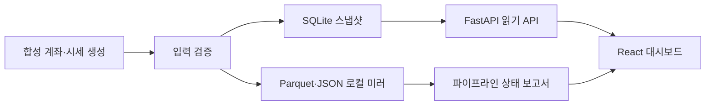

# ReachRich Public Lab

[](https://github.com/YongjaeKwon/quant-lab/actions/workflows/tests.yml)

개인 퀀트 프로젝트 ReachRich는 실계좌와 증권사 연동이 얽혀 있어 공개할 수 없습니다. 그래서 보여줄 수 있는 부분만 따로 다시 만들었습니다. 데이터를 어떻게 저장하고 검증하고 조회하는지 — 그 경계와 흐름을 합성 데이터 위에 같은 방식으로 재현한 저장소입니다.

비공개 프로젝트의 미러가 아닙니다. 실제 계좌, 토스증권·KRX 연동, 전략, 성과는 여기에 없고, 실행하면 보이는 금액과 종목은 전부 고정 규칙으로 만든 가상 값입니다.

## 무엇을 확인할 수 있나

| 확인할 내용 | 구현 방식 | 시작점 |
| --- | --- | --- |
| 재실행 가능한 데이터 준비 | 같은 날짜는 교체하는 SQLite 스냅샷과 날짜 기준 Parquet upsert | [`operation/demo_pipeline.py`](operation/demo_pipeline.py) |
| 저장소와 API의 분리 | FastAPI는 외부 서비스를 호출하지 않고 로컬 미러만 조회 | [`console/api.py`](console/api.py) |
| 시계열 입력 검증 | 정렬·중복·미래 시점·OHLC 일관성을 저장 전에 확인 | [`validation/time_series.py`](validation/time_series.py) |
| 사용자 상태를 고려한 화면 | React에서 로딩·오류·빈 상태, 금액 가리기, 테마, 비활성 탭 폴링 중단 처리 | [`console/web/src/App.tsx`](console/web/src/App.tsx) |
| 공개 범위의 명시적 분리 | 전략은 인터페이스만 남기고 구체적인 구현과 성과 데이터는 제외 | [`strategy/contracts.py`](strategy/contracts.py) |

## 데이터 흐름



시드와 대시보드 실행에는 외부 증권사 요청이 없습니다. Python·Node 패키지를 처음 설치할 때만 각 패키지 저장소에 접속합니다.

## 비공개 쪽은 지금 어디까지 왔나

맥락을 조금 적어두면, ReachRich에서는 지금 이런 것들이 매일 자동으로 돌아갑니다. 아침마다 증권사 API로 실계좌 스냅샷을 받아 웹 대시보드에 그리고, 페이퍼트레이딩이 GitHub Actions에서 무인으로 적립되고, 거래가 생기면 의사결정 시점의 차트를 얼려서 매매일지에 쌓습니다. 시장 국면과 종목 등급도 매일 계산합니다. 실전 주문은 아직 없습니다. 백테스트 관문을 통과한 전략이라도 모의 운용에서 전진 검증을 다시 통과해야 실전 후보가 된다는 규칙을 정해두었고, 그 전까지 실전 자금은 0입니다.

가장 공들인 건 기능이 아니라 검증 절차입니다. 개인 퀀트의 가장 큰 적은 시장이 아니라 자기기만이라고 생각해서, 그걸 의지가 아니라 구조로 막았습니다. 백테스트 러너는 전략에게 항상 그 시점까지의 데이터만 넘기게 되어 있어 미래 참조가 구조적으로 불가능하고, 모든 실험 시도는 원장에 자동으로 쌓여서 시도가 많아질수록 합격 기준이 저절로 깐깐해집니다. 파라미터 탐색은 평가를 시작하기 전에 후보 목록을 원장에 등록해야 하고, 등록에 없는 후보를 나중에 끼워 넣으려 하면 원장이 거부합니다.

이 절차가 실제로 일한 적도 있습니다. 시장 국면 분류기의 첫 검증은 기준 미달이었는데, 결과를 지우고 조용히 다시 돌리는 대신 실패를 기록으로 남기고 수정안을 새 가설로 등록해서 재검증했습니다. 그 과정에서 데이터 결함 하나와 판정 기준 자체의 약점 하나가 드러났고, 고친 버전이 기준을 넘었습니다. 실패한 버전의 기록도 원장에 그대로 있습니다. 운영 쪽도 비슷한 태도인데, 예전에 스케줄러가 조용히 멈춘 걸 두 달 뒤에야 알아차린 사고가 있어서 지금은 어느 잡이 죽어도 알림이 오게 되어 있습니다.

이 공개 저장소가 재현하는 스냅샷 교체 저장, 날짜 기준 upsert, 시계열 입력 검증 같은 것들이 전부 그 시스템에서 실제로 쓰는 방식입니다.

## 빠른 실행

요구 환경은 Python 3.11 이상과 Node.js 20 이상입니다. 아래 예시는 PowerShell 기준입니다.

```powershell
py -3.12 -m venv .venv
.\.venv\Scripts\Activate.ps1
python -m pip install -e ".[dev]"

npm.cmd ci --prefix console/web
npm.cmd run build --prefix console/web

python -m scripts.seed_demo --reset --asof 2026-08-07
python -m scripts.dashboard
```

실행 후 아래 주소에서 확인할 수 있습니다.

- 대시보드: <http://127.0.0.1:8720>
- Swagger UI: <http://127.0.0.1:8720/docs>
- 상태 확인: <http://127.0.0.1:8720/api/health>

대시보드는 인증 없이 로컬에서만 실행되며, 실행 스크립트는 `127.0.0.1` 또는 `localhost` 이외의 바인딩을 거부합니다.

### 프런트엔드 개발 모드

두 터미널에서 API와 Vite를 각각 실행합니다.

```powershell
# terminal 1
python -m scripts.dashboard

# terminal 2
npm.cmd run dev --prefix console/web
```

Vite 개발 서버는 `/api` 요청을 `127.0.0.1:8720`으로 전달합니다.

## 검증

전체 검증은 다음 명령으로 실행합니다.

```powershell
.\scripts\verify.ps1
```

개별 명령은 아래와 같습니다.

```powershell
python -m pytest -q
python -m scripts.seed_demo --reset --root data/verification --asof 2026-08-07
python -m scripts.seed_demo --root data/verification --asof 2026-08-07
python -m scripts.health_check --root data/verification --asof 2026-08-07
npm.cmd test --prefix console/web
npm.cmd run build --prefix console/web
```

같은 기준일로 시드를 두 번 실행해도 스냅샷·캔들·환율 행 수는 늘어나지 않습니다. GitHub Actions도 동일한 백엔드·데이터 검증과 프런트엔드 테스트·빌드만 수행하며, 저장소 쓰기 권한이나 secret을 사용하지 않습니다.

## 현재 구현 범위

- 45개 영업일의 합성 계좌 스냅샷 생성
- 5개 가상 종목의 30개 영업일 OHLCV 생성
- SQLite 계좌·보유 항목 저장과 날짜별 교체
- Parquet 캔들 upsert, 기준일별 universe JSON, 일별 가상 환율 저장
- 상태·요약·기간별 이력·보유 항목·파이프라인 상태 조회 API
- React·TypeScript 대시보드와 합성 데이터 고지
- 기간 선택, 금액 가리기, 라이트·다크·시스템 테마
- 숨겨진 브라우저 탭에서 주기 조회 중단
- 백엔드 pytest, 프런트엔드 Vitest, TypeScript 프로덕션 빌드

구체적인 전략은 [`Strategy`](strategy/contracts.py) 프로토콜의 경계만 공개합니다. [`walk_forward_windows`](validation/time_series.py)는 일반적인 시계열 분할 도우미이며, 현재 합성 데이터 시드 과정에서는 실행하지 않습니다.

## 저장소 구조

```text
quant-lab/
├── console/             # FastAPI 읽기 API와 React 대시보드
├── datastore/           # SQLite·Parquet 로컬 저장소
├── operation/           # 합성 데이터 생성과 파이프라인 조립
├── strategy/            # 공개 인터페이스만 포함
├── universe/            # 가상 종목 universe
├── validation/          # 시계열 입력 검증과 분할 도우미
├── scripts/             # 시드·실행·상태 확인·전체 검증
├── tests/               # Python 테스트
└── docs/                # 구조·공개 범위·데이터 무결성·운영 문서
```

## 문서

- [아키텍처와 데이터 흐름](docs/ARCHITECTURE.md)
- [공개 범위와 비공개 프로젝트의 경계](docs/PUBLIC_SCOPE.md)
- [멱등성·시계열 검증 기준](docs/DATA_INTEGRITY.md)
- [실행·검증·CI 운영 방법](docs/OPERATIONS.md)

## 주의

이 프로젝트는 소프트웨어 설계와 구현을 설명하기 위한 합성 데이터 데모입니다. 투자 자문, 종목 추천, 실제 자동매매 시스템 또는 수익 성과의 증빙을 제공하지 않습니다.
