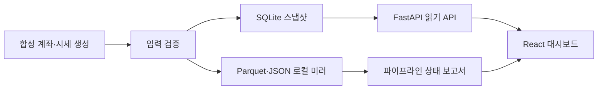

# ReachRich Public Lab

[](https://github.com/YongjaeKwon/quant-lab/actions/workflows/tests.yml)

ReachRich라는 개인 퀀트 프로젝트를 만들고 있습니다. 실계좌 정보와 증권사 연동이 섞여 있어서 그 저장소를 그대로 공개하긴 어렵고, 대신 공개할 수 있는 부분만 떼어내 여기에 다시 만들었습니다. 데이터를 저장하고 검증하고 조회하는 방식은 원본과 같지만, 흘러다니는 데이터는 전부 규칙으로 만든 가짜입니다.

비공개 저장소를 복사해서 민감한 부분만 지운 게 아니라 처음부터 새로 짰습니다. 실제 계좌, 토스증권·KRX 연동, 전략, 성과는 여기 없습니다. 화면에 보이는 금액과 종목도 모두 가상입니다.

## 주요 구현

| 확인할 내용 | 구현 방식 | 시작점 |
| --- | --- | --- |
| 재실행 가능한 데이터 준비 | 같은 날짜는 교체하는 SQLite 스냅샷과 날짜 기준 Parquet upsert | [`operation/demo_pipeline.py`](operation/demo_pipeline.py) |
| 저장소와 API의 분리 | FastAPI는 외부 서비스를 호출하지 않고 로컬 미러만 조회 | [`console/api.py`](console/api.py) |
| 시계열 입력 검증 | 정렬·중복·미래 시점·OHLC 일관성을 저장 전에 확인 | [`validation/time_series.py`](validation/time_series.py) |
| 사용자 상태를 고려한 화면 | React에서 로딩·오류·빈 상태, 금액 가리기, 테마, 비활성 탭 폴링 중단 처리 | [`console/web/src/App.tsx`](console/web/src/App.tsx) |
| 공개 범위의 명시적 분리 | 전략은 인터페이스만 남기고 구체적인 구현과 성과 데이터는 제외 | [`strategy/contracts.py`](strategy/contracts.py) |

## 데이터 흐름



시드를 만들거나 대시보드를 띄울 때 외부로 나가는 요청은 없습니다. 처음 패키지를 설치할 때만 PyPI와 npm에 접속합니다.

## 원본 프로젝트

ReachRich는 검증 규율을 중심에 둔 개인 투자 시스템입니다. 현재 다음 작업이 매일 자동으로 돌아갑니다.

- 증권사 API 실계좌 스냅샷 수집과 웹 대시보드
- GitHub Actions 기반 페이퍼트레이딩 적립
- 거래 시점 차트를 함께 저장하는 매매일지
- 시장 국면·종목 등급 일일 계산

실전 주문 기능은 아직 없습니다. 백테스트를 통과한 전략이라도 모의 운용 전진 검증을 거쳐야 실전 후보가 됩니다.

검증 쪽 원칙은 이렇습니다.

- 백테스트 러너는 전략에 해당 시점까지의 데이터만 전달합니다. 미래 참조가 코드 구조상 불가능합니다.
- 모든 실험 시도는 원장에 자동 기록되고, 시도가 늘수록 합격 기준이 높아집니다.
- 파라미터 탐색은 후보를 사전 등록한 뒤에만 진행합니다. 등록에 없는 후보는 원장이 거부합니다.
- 검증에 실패한 가설은 삭제하지 않고 기록으로 남깁니다. 수정안은 새 가설로 다시 검증합니다.

이 저장소의 스냅샷 교체 저장, 날짜 기준 upsert, 시계열 입력 검증은 모두 원본에서 실제로 쓰는 방식입니다.

## 빠른 실행

Python 3.11 이상, Node.js 20 이상이 필요합니다. 아래는 PowerShell 기준입니다.

```powershell
py -3.12 -m venv .venv
.\.venv\Scripts\Activate.ps1
python -m pip install -e ".[dev]"

npm.cmd ci --prefix console/web
npm.cmd run build --prefix console/web

python -m scripts.seed_demo --reset --asof 2026-08-07
python -m scripts.dashboard
```

실행하면 여기서 열립니다.

- 대시보드: <http://127.0.0.1:8720>
- Swagger UI: <http://127.0.0.1:8720/docs>
- 상태 확인: <http://127.0.0.1:8720/api/health>

대시보드는 인증 없이 로컬에서만 돌고, 실행 스크립트가 `127.0.0.1`·`localhost` 밖의 바인딩을 거부합니다.

### 프런트엔드 개발 모드

터미널 두 개에서 API와 Vite를 각각 띄웁니다.

```powershell
# terminal 1
python -m scripts.dashboard

# terminal 2
npm.cmd run dev --prefix console/web
```

Vite 개발 서버가 `/api` 요청을 `127.0.0.1:8720`으로 넘겨줍니다.

## 검증

전체 검증은 한 번에 돌릴 수 있습니다.

```powershell
.\scripts\verify.ps1
```

개별 명령은 다음과 같습니다.

```powershell
python -m pytest -q
python -m scripts.seed_demo --reset --root data/verification --asof 2026-08-07
python -m scripts.seed_demo --root data/verification --asof 2026-08-07
python -m scripts.health_check --root data/verification --asof 2026-08-07
npm.cmd test --prefix console/web
npm.cmd run build --prefix console/web
```

같은 기준일로 시드를 두 번 돌려도 스냅샷·캔들·환율 행 수는 그대로입니다. GitHub Actions도 같은 검증과 프런트엔드 테스트·빌드만 하고, 저장소 쓰기 권한이나 secret은 쓰지 않습니다.

## 현재 구현 범위

- 45개 영업일의 합성 계좌 스냅샷 생성
- 5개 가상 종목의 30개 영업일 OHLCV 생성
- SQLite 계좌·보유 항목 저장과 날짜별 교체
- Parquet 캔들 upsert, 기준일별 universe JSON, 일별 가상 환율 저장
- 상태·요약·기간별 이력·보유 항목·파이프라인 상태 조회 API
- React·TypeScript 대시보드와 합성 데이터 고지
- 기간 선택, 금액 가리기, 라이트·다크·시스템 테마
- 숨겨진 브라우저 탭에서 주기 조회 중단
- 백엔드 pytest, 프런트엔드 Vitest, TypeScript 프로덕션 빌드

전략은 [`Strategy`](strategy/contracts.py) 인터페이스만 공개합니다. 구현과 파라미터는 비공개 쪽에 있습니다. [`walk_forward_windows`](validation/time_series.py)는 일반적인 시계열 분할 도우미이고, 합성 데이터 시드 과정에서는 쓰지 않습니다.

## 저장소 구조

```text
quant-lab/
├── console/             # FastAPI 읽기 API와 React 대시보드
├── datastore/           # SQLite·Parquet 로컬 저장소
├── operation/           # 합성 데이터 생성과 파이프라인 조립
├── strategy/            # 공개 인터페이스만 포함
├── universe/            # 가상 종목 universe
├── validation/          # 시계열 입력 검증과 분할 도우미
├── scripts/             # 시드·실행·상태 확인·전체 검증
├── tests/               # Python 테스트
└── docs/                # 구조·공개 범위·데이터 무결성·운영 문서
```

## 문서

- [아키텍처와 데이터 흐름](docs/ARCHITECTURE.md)
- [공개 범위와 비공개 프로젝트의 경계](docs/PUBLIC_SCOPE.md)
- [멱등성·시계열 검증 기준](docs/DATA_INTEGRITY.md)
- [실행·검증·CI 운영 방법](docs/OPERATIONS.md)

## 주의

소프트웨어 설계와 구현을 설명하기 위한 합성 데이터 데모입니다. 투자 자문이나 종목 추천이 아니고, 실제 자동매매 시스템이나 수익 성과의 증빙도 아닙니다.
