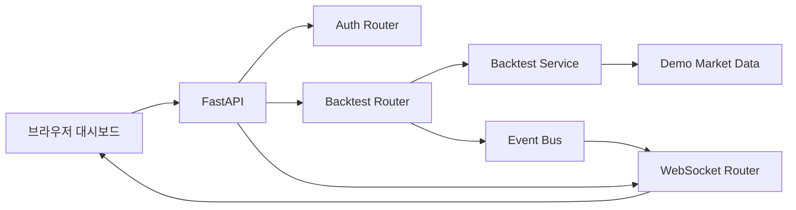

# 아키텍처

`quant-lab`은 원본 private 프로젝트의 핵심 구조를 공개 가능한 수준으로 단순화한 예시입니다.

## 계층

| 계층 | 역할 |
| --- | --- |
| `api/routes` | HTTP, WebSocket 진입점 |
| `api/deps.py` | 인증 의존성 |
| `core` | 설정과 데모 토큰 처리 |
| `services` | 샘플 데이터, 백테스트 계산, 이벤트 브로드캐스트 |
| `dashboard` | API와 WebSocket을 확인하는 정적 화면 |

## 원본과 다른 점

- 실제 거래소·증권사 연동은 없습니다.
- 실제 전략과 성과 데이터는 없습니다.
- DB/Redis 없이도 구조를 확인할 수 있게 메모리 기반으로 단순화했습니다.
- 인증 토큰은 공개용 데모 구조이며 운영용 보안 구현이 아닙니다.
