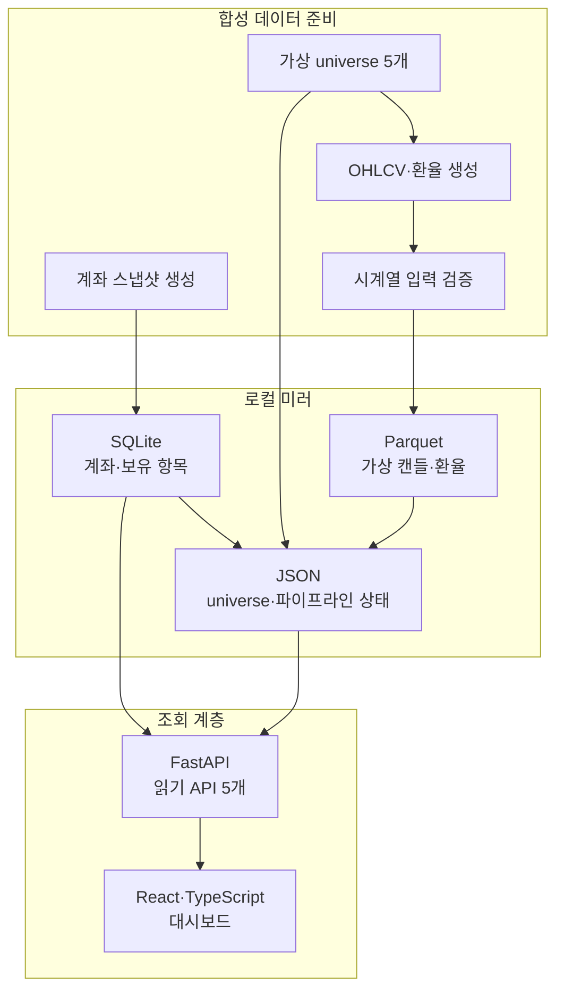

# 아키텍처

## 목적

ReachRich Public Lab은 비공개 `ReachRich`의 운영 코드를 복사한 저장소가 아니다. 실제 연동을 제거한 상태에서도 아래 설계 결정을 실행하고 검증할 수 있도록 공개용으로 다시 구성했다.

- 외부 응답을 곧바로 화면에 전달하지 않고 로컬 미러를 경계로 둔다.
- 같은 기준일 작업은 여러 번 실행해도 중복되지 않게 저장한다.
- API는 저장된 데이터를 읽는 역할에 집중한다.
- 화면은 API 상태와 데이터 공개 범위를 사용자에게 분명히 보여준다.

## 전체 흐름

`seed_demo` 실행 경로에는 HTTP 클라이언트나 외부 증권사 어댑터가 없다. 계좌·시세는 수식과 고정된 가상 universe로 생성된다.

## 모듈 경계

| 모듈 | 현재 역할 | 의도적으로 포함하지 않은 것 |
| --- | --- | --- |
| `universe` | 5개 가상 종목 정의 | 실제 종목 선정과 랭킹 응답 |
| `strategy` | 전략이 따라야 할 `Protocol`과 신호 모델 | 구체적인 투자 규칙·파라미터 |
| `validation` | 캔들 입력 검증, purged gap을 둔 walk-forward 분할 도우미 | 전략 평가 결과와 승격 기준 |
| `datastore` | SQLite 스냅샷, Parquet 캔들·환율, JSON universe | 실제 계좌 DB와 시장 데이터 |
| `operation` | 합성 데이터 생성, 검증·저장 조립, 상태 보고서 작성 | 주문·승인·알림·스케줄러 |
| `console` | 로컬 미러를 읽는 FastAPI와 React 화면 | 공개 서버 인증과 다중 사용자 기능 |

모듈 이름은 비공개 프로젝트의 책임 구분을 이해할 수 있게 남겼지만, 내부 구현은 공개 범위에 맞춰 새로 작성했다. 따라서 이 저장소만으로 비공개 프로젝트의 전체 구조나 운용 방식을 재현할 수 없다.

## 시드 파이프라인

[`operation/demo_pipeline.py`](../operation/demo_pipeline.py)의 `seed_demo`는 다음 순서로 동작한다.

1. 기준일부터 최근 45개 영업일을 계산한다.
2. 수식으로 계좌 요약과 세 개의 가상 보유 항목을 만든다.
3. SQLite에 기준일별 스냅샷을 저장한다.
4. 5개 가상 종목에 대해 30개 영업일의 OHLCV를 만든다.
5. 정렬·중복·미래 시점·가격 일관성을 검사한다.
6. 검증된 캔들을 종목별 Parquet에 upsert한다.
7. 기준일 universe와 가상 환율을 저장한다.
8. 각 단계의 상태를 `pipeline-report.json`으로 교체 기록한다.

`--asof`를 같은 값으로 주고 다시 실행하면 저장된 행 수는 변하지 않는다. 자세한 규칙은 [DATA_INTEGRITY.md](DATA_INTEGRITY.md)에 정리했다.

## 조회 API

FastAPI는 시작 시 합성 데이터를 준비한 뒤 SQLite와 파이프라인 상태 파일만 읽는다.

| 메서드·경로 | 응답 |
| --- | --- |
| `GET /api/health` | 합성 데이터 여부와 마지막 스냅샷 기준일 |
| `GET /api/account/summary` | 마지막 계좌 요약 |
| `GET /api/account/history?days=30` | 마지막 기준일로부터 지정한 달력 일수 내 이력 |
| `GET /api/account/holdings` | 마지막 기준일의 가상 보유 항목 |
| `GET /api/pipeline/status` | 합성 데이터 준비 단계별 상태 |

`days`는 반환 행 개수가 아니라 마지막 스냅샷을 기준으로 한 달력 일수이며, `1`부터 `365`까지만 허용한다.

API는 계좌·시장 제공자에게 요청하지 않는다. 프런트엔드도 FastAPI 외의 외부 데이터 소스에 연결하지 않는다.

## 화면 제공 방식

- `console/web/dist`가 있으면 FastAPI가 `/`에 정적 파일을 마운트한다.
- 개발 중에는 Vite가 `/api`를 `127.0.0.1:8720`으로 프록시한다.
- 화면은 `sample_data` 플래그와 별개로 상단에 합성 데이터 고지를 항상 표시한다.
- 30초 주기 조회는 브라우저 탭이 보일 때만 실행한다. 탭이 다시 보이면 즉시 새로 조회한다.
- 금액 가리기와 테마 선택은 브라우저 `localStorage`에만 저장한다.

## 실행 경계

대시보드에는 사용자 인증이 없다. 대신 [`scripts/dashboard.py`](../scripts/dashboard.py)가 `127.0.0.1`과 `localhost` 외의 호스트를 거부한다. 이 제한은 공개 인터넷 배포를 위한 보안 대책이 아니며, 현재 데모를 로컬 확인 용도로 한정하는 장치다.

웹에 배포하려면 인증·권한·HTTPS·데이터 격리를 별도로 설계해야 한다. 현재 저장소는 그 범위를 구현하거나 주장하지 않는다.
